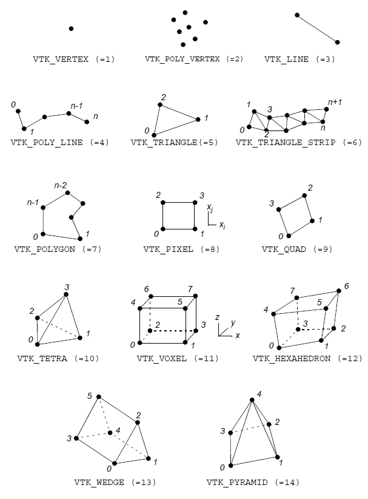
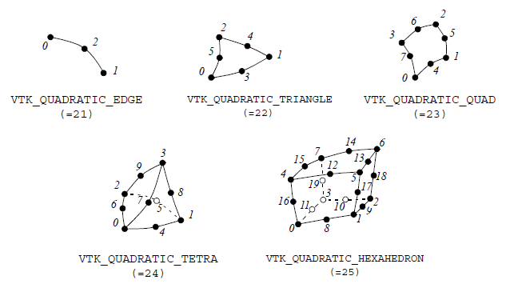

This visualisation toolbox is used for exporting FEM results computed in Matlab to .vtu files which can be then opened by Paraview. 

---

# VTU File Structure Exported files #

The exported `.vtu` file is wrapped by the staring tags `<VTKFile>`, `<UnstructuredGrid>` and `<Piece>`, and closing tags `</Piece>`, `</VTKFile>` and `</UnstructuredGrid>`, in the given order.
The actuall data for the visualization is defined in the innermost block, i.e. the Piece-block, and includes the following for 4 blocks:

- Points
- Cells
- PointData
- CellData

While the "Points" and "Cells" blocks define the mesh itself, the "PointData" and "CellData" define the nodal, and element-wise results to be plotted, respectively. It is not necessary to have both "PointData" and "CellData", if the
mesh contains only nodal results, such as displacements, the "CellData" can be left out.

## **Points** ##
In the block defined by the tags `<Points>` and `</Points>`, the nodal coordinates are defined. Note that for 2D data, the z-coordinates cannot miss, but it has to be zero.

## **Cells** ##
In the block marked by the tags `<Cells>` and `</Cells>`, the topology data is given using the following sub-blocks defined as DataArrays:

 - connectivity
 - offsets
 - types

### **DataArray: "connectivity"** ###
The connectivity matrix defines which points from the Points-block constitute the individual elements. The data in the connectivity matrix is read row-by-row from left to right. Note that connectivity array does not have to be a 
matrix with a consistent size, but the number of columns can vary in each row. Why this is not a problem, is explained in the "offsets" sub-section. Nonetheless, although it is not necessary, the connectivity matrix can be structured,
such that each element with its corresponding nodes are defined in individual lines. Finally, note that the numbering starts from 0.

### **DataArray: "offsets"** ###
Since the connectivity array is parsed by simply scanning its content linearly, Paraview must know which elements are defined by which points. For this, the "offsets" vector is used, which tells which element is defined by how many 
consequtive nodal IDs in the connectivity array. Note that this allows for a meshes containing different element types. As an example, if the "offsets" array starts with the values 4, 4, 3, it means that the first element is defined 
by the first 4 entries in the connectivity matrix, then, entries 5-8 define the second element, while the entries 9-11 (3 nodes) the third one.

### **DataArray: "types"** ###
This block defines for each element an integer referring to its element type, such as 9 for linear quadratic elements, or 5 for linear triangular elements. 

Which element type is used, is defined determined in the function 'writevtu.m'. No user input is needed.

## **Point Data** ##
This block contains nodal values, i.e. results associated with the different nodes, such as displacements, strain and stresses. Each of the different fields is stored in its own DataArray. The field names and number of components
are given in the opening DataArray tag by "Name" and "NumberOfComponents".  

## **Cell Data** ##
In some cases, the exported data contains values, that are accosiated with the elements and not by the nodes, such as material IDs, or domain IDs. Such data is defined in the "CellData" block.


--- 
# Usage #
The exporting to Paraview is achieved using the three functions

 - `writevtu(...)`
 - `writeParaviewCollection(...)`
 - `mergeParaviewFiles2Collection(...)`

elaborated below.

## Usage of writevtu(...) ##

The `.vtu` file is created by the Matlab function `writevtu(dim,DataStructures,PlotSettings)` with the following inputs.

**dim** - Dimension of the problem. It should be either '2D' or '3D'.

**DataStructures** - It is a cell array containing relavant information for a part of the mesh. If the mesh contains multiple element types, each data associated with the different element types is a unique cell in the `DataStructures`, like
<br/><br/>
```matlab
DataStructures{1} = DataStructure1;
DataStructures{2} = DataStructure2;
```

Each DataStructure contains 4 fields, `DataStructure1.Points`, `DataStructure1.Connectivity`, `DataStructure1.PointData`, and `DataStructure1.CellData`, where the first 2 field contain mesh-data and the second two results associated with the
nodes and cells. Both `PointData` and `CellData` are cell arrays, where for each field to be plotted, a new cell is created. For example, the first field in `PointData` may contain the displacements
<br/><br/>

```matlab
DataStructure1.PointData{1}.name = 'Displacement';
DataStructure1.PointData{1}.array = [UX, UY, UZ];
```

while the second field is an arbitrary function with 4 fields. Here, also the component names are given.
<br/><br/>

```matlab
DataStructure1.PointData{2}.name = 'My function';
DataStructure1.PointData{2}.componentNames = {'F1', 'F1', 'F3', 'F4'};
DataStructure1.PointData{2}.array = [F1, F2, F3, F4];
```

The same structure applies also to content of `CellData`. For example:
<br/><br/>

```matlab
DataStructure1.CellData{1}.name = 'Material IDs';
DataStructure1.CellData{1}.array = matIDs;
```


**PlotSettings** - It is a structure variable with the fields `PlottSettings.filedir`, `PlottSettings.filename`, and `PlottSettings.fileInfo`, where the first two fields are self-explanatory. The third field allows the user to write
additional information, meta-data to the exported .vtu file. The content of `fileInfo` will be added as comments to the vtu file. If `fileInfo` contains so much text that it requires multiple lines in the vtu file, `fileInfo` is a
cell array, and the strings stored in the individual cells are written below each other. A use-case for `fileInfo` is for example the excitation frequency or step data associated with the given plot. If no `fileInfo` is required, simply
write `fileInfo = "";`.  

***NOTE***: If a simulation with multiple time steps, loads steps, frequency steps, etc. is conducted, the results associated with the indivudual steps should be exported to individual `.vtu` files with the numbering format
<br/><br/>


```matlab
myExportedData_001.vtu'
myExportedData_002.vtu'
myExportedData_003.vtu'
...
```

or
<br/><br/>

```matlab
myExportedData_1.vtu'
myExportedData_2.vtu'
myExportedData_3.vtu'
...
```

Of course, if the format `myExportedData_00i.vtu` is used, `myExportedData_00000i.vtu` is also valid, if there are so many steps to be exported. Then, the exported `.vtu` files can be merged to so called *Collections* and
stored in a single `.pvd` file using the functions `writeParaviewCollection(...)` and `mergeParaviewFiles2Collection(...)`. 

## Usage of writeParaviewCollection(...) ##

The function is used if there are multiple `.vtu` files associated with different time steps or deformations steps, which should be merged into a `.pvd` file to open the simulation results in Paraview more 
efficiently. Note that idividually importing all exported `.vtu` files in Paraview results in overfilling the *Pipeline Browser*, and it also does not allow for using *Filters* that analyze the results over the
entire time range. The function is called with the inputs `writeParaviewCollection(sourceFolder,sourceFilenames,goalFolder,goalFilename,timesteps)`, where `sourceFolder` is a string of the folder containing the individual
`.vtu` files, and `sourceFilenames` is a cell array containing all the filenames that should be added to the collection. Furthermore, `goalFolder` and `goalFilename` are the location to export to and name chosen for the 
`.pvd` file. Finally, the input `timeSteps` contains the time values associated with the individual `.vtu` files. If a large deformation analysis or frequency domain analyis is conducted, `timeSteps` simply contains 
the load parameter or the excitation frequency. 


## Usage of mergeParaviewFiles2Collection(...) ##

This function is called with the inputs `mergeParaviewFiles2Collection(sourceFolder,goalFolder,goalFilename,timesteps)` and it is really similar to `writeParaviewCollection(...)`. The only difference is that it does not require 
the input of `sourceFilenames`, and instead it simply uses all the files in the given source folder, provided that these have a coherent file names and numbering. 

Clearly, the functionality of `mergeParaviewFiles2Collection(...)` could be simply integrated into `writeParaviewCollection(...)` by enabling the passing of an empty input for `sourceFilenames`. Mabye in the future...

## Element types ##


